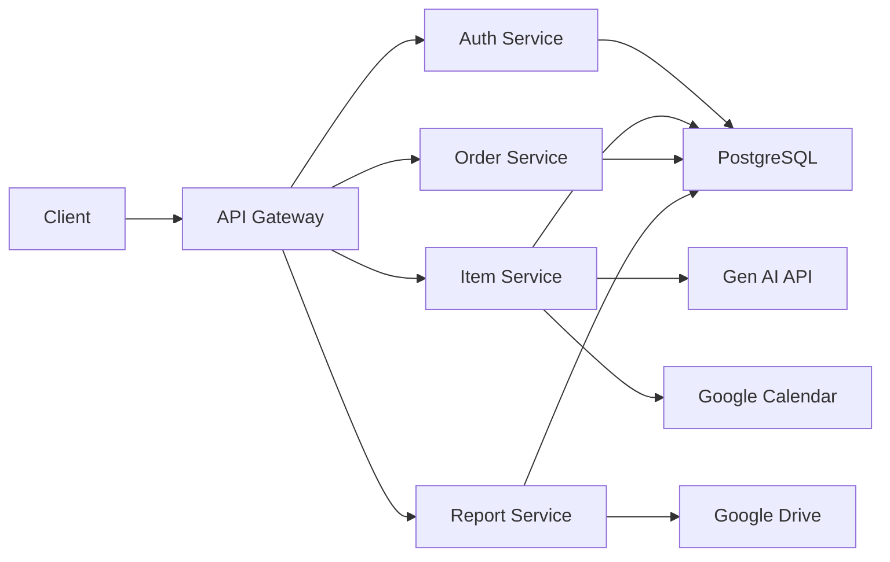
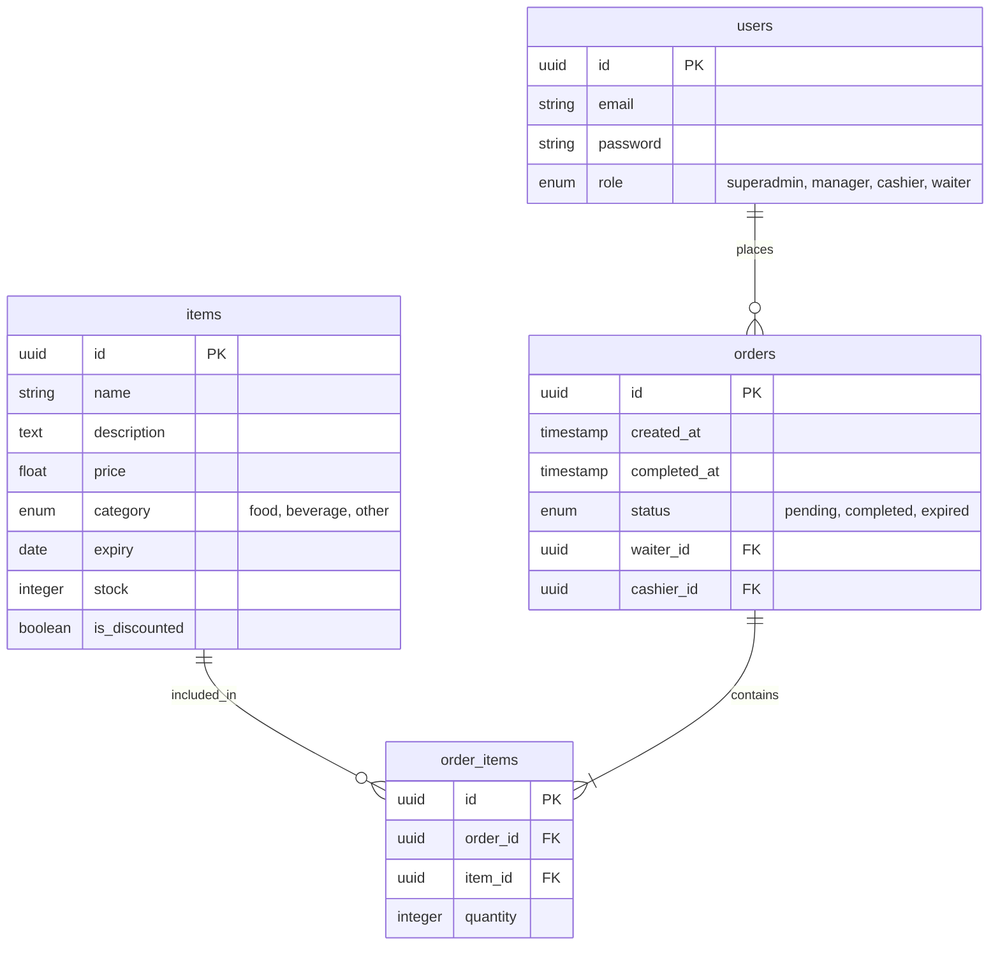
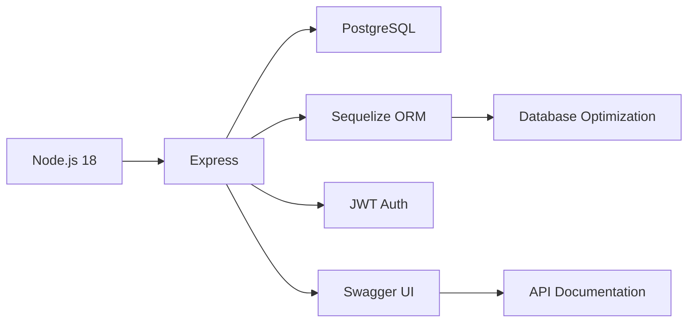

### **GeekyAir: Inventory & Order Management System**

> _Elevating hospitality operations with AI-driven efficiency._

[](https://nodejs.org/)
[](https://expressjs.com/)
[](https://www.postgresql.org/)
[](https://swagger.io/)

### ⚙️ **System Architecture**



---

### 🌟 **Key Features**

#### **1. Intelligent Inventory Management**

- **Role-Based CRUD Operations**: Admins/Managers create/update items; waiters view non-expired items only.
- **Smart Notifications**: Automated email alerts 5 days before + on expiry day.
- **Discount Automation**: 25% discount applied to items expiring in ≤20 days.
- **Advanced Filtering**: Sort by name, price, expiry, or stock value (price × quantity).

#### **2. Order Processing Engine**

- **Real-Time Status Updates**: Orders auto-expire after 4 hours if pending.
- **Multi-Item Orders**: Calculate totals dynamically; assign orders to waiters.
- **Expiry Enforcement**: Prevent expired items from being added.

#### **3. Secure Authentication**

- **Role-Based Access Control (RBAC)**:
  - **Super Admin/Managers**: Full system control.
  - **Cashiers**: Manage orders.
  - **Waiters**: View assigned orders/items.
- **Email Verification + Password Reset**.

#### **4. AI-Powered Analytics**

- **Waiter Commission Reports**:
  - Filter by date/waiter; export CSV via `?export=true&format=csv`.
  - Commissions: Food (1%), Beverages (0.5%), Others (0.25%).
- **Gen AI Promotions**:
  - Auto-generate SMS/social promos for:
    - New food items (price ≥ 200).
    - 500+ sales in 10 days.

#### **5. Automated Integrations**

- **Google Drive**: Auto-export sales reports (CSV/PDF).
- **Google Calendar**: Sync expiry reminders ("Use 50 sandwiches by 25/05").
- **CSV Import/Export**: Bulk item management for admins.

---

### 🗃️ **Database Schema**



---

### 🚀 **Setup Guide**

**Prerequisites**: Node.js v18+, PostgreSQL.

1. **Clone Repository**:

   ```bash
   git clone https://github.com/engyahmed7/GeekyAir-assesment.git
   cd GeekyAir-assesment
   ```

2. **Install Dependencies**:

   ```bash
   npm install
   ```

3. **Configure Environment**:  
   Duplicate `.env.example` → `.env`:

   ```env
   DB_HOST=localhost
   DB_PORT=5432
   DB_USER=postgres
   DB_PASS=your_password
   DB_NAME=geekyair
   JWT_SECRET=super_secret_key
   SMTP_HOST=smtp.example.com # For email alerts

   GOOGLE_API_KEY=YOUR_GOOGLE_API_KEY

   GOOGLE_CLIENT_ID=YOUR_GOOGLE_CLIENT_ID
   GOOGLE_CLIENT_SECRET=YOUR_GOOGLE_CLIENT_SECRECT
   ```

4. **Run Migrations**:

   ```bash
   npx sequelize-cli db:migrate
   ```

5. **Start Server**:
   ```bash
   npx nodemon
   ```

---

### 📚 **API Documentation**

- **Swagger UI**: `http://localhost:3000/api/docs`
- **Postman Collection**:  
  [](https://www.postman.com/maintenance-candidate-1003460/geekyair/documentation/ajphy62/geekyair)
  - Environment: `GeekyAir_Dev` (base URL: `http://localhost:3000/api`)

**Sample Endpoints**:  
| Endpoint | Method | Role Access | Description |
|------------------------------|--------|---------------------|--------------------------------------|
| `/api/items` | GET | All authenticated | Filter/sort items (e.g., `?sort=price&order=desc`) |
| `/api/orders` | POST | Cashiers | Create new order |
| `/api/reports/commissions` | GET | Admins/Cashiers | Generate waiter commissions report |
| `/admin/items/import` | POST | Admins/Managers | Bulk import items via CSV |

---

### 🛠️ **Tech Stack**


---

### 🧪 **Testing**

```bash
npm test
```

---

### ✨ **Bonus Features Implemented**

1. **Gen AI Promotions** (via OpenAI API)
2. **Auto-Discounts for Expiring Items**
3. **Google Drive Sales Reports** (OAuth2)
4. **Google Calendar Expiry Sync**
5. **Swagger Documentation**

---
